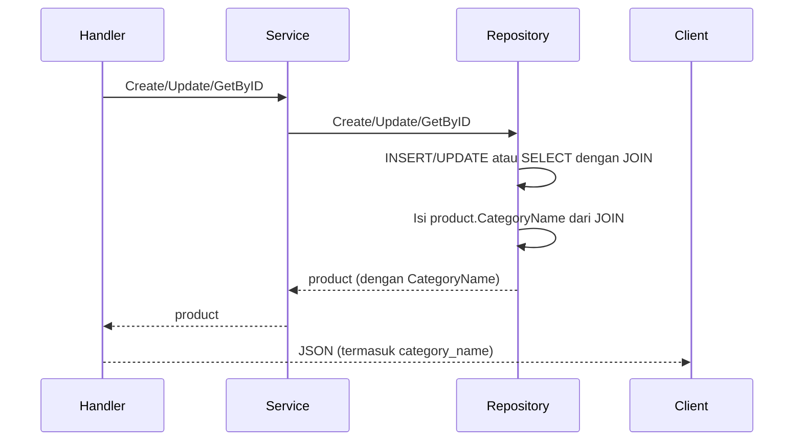

# Rencana: JOIN Product–Category untuk Menampilkan Category Name

## Konteks

Saat ini [models/product.go](models/product.go) punya `CategoryId` saja; response API tidak menyertakan nama kategori. Relasi: `products.category_id` → `categories.id`. Tabel di repo: `products` dan `Categories` (lihat [repositories/category_repository.go](repositories/category_repository.go)).

## Alur response dengan category name



## Perubahan per file

### 1. Model Product — tambah field response

**File:** [models/product.go](models/product.go)

- Tambah field `CategoryName string` dengan tag `json:"category_name,omitempty"`.
- Hanya untuk response; request Create/Update tetap pakai `category_id` saja.

```go
CategoryName string `json:"category_name,omitempty"` // dari JOIN, hanya response
```

### 2. Repository Product — query JOIN dan isi CategoryName

**File:** [repositories/product_repository.go](repositories/product_repository.go)

- **GetByID**
  - Ganti query jadi JOIN:  
    `SELECT p.id, p.name, p.price, p.stock, p.category_id, c.name FROM products p LEFT JOIN categories c ON p.category_id = c.id WHERE p.id = $1`
  - Scan kolom terakhir ke `&p.CategoryName`.
  - Pakai tabel `categories` (atau `Categories` jika DB Anda case-sensitive).
- **Create**
  - Tetap: `INSERT ... RETURNING id` lalu `Scan(&product.ID)`.
  - Setelah itu panggil `GetByID(product.ID)` (yang sudah pakai JOIN), lalu copy `CategoryName` ke `product` yang di-pass (pointer), agar response handler berisi `category_name`.
- **Update**
  - Tetap: `UPDATE products SET ... WHERE id = $5`.
  - Setelah update sukses, panggil `GetByID(product.ID)` dan copy `CategoryName` ke `product` yang di-pass, agar response berisi `category_name`.

Service dan handler tidak perlu diubah: mereka sudah mengembalikan `*models.Product` / `models.Product`; repository yang mengisi `CategoryName`.

### 3. (Opsional) GetAll — konsistensi daftar

**File:** [repositories/product_repository.go](repositories/product_repository.go)

- **GetAll**: ubah query ke `SELECT p.id, p.name, p.price, p.stock, p.category_id, c.name FROM products p LEFT JOIN categories c ON p.category_id = c.id`, scan `c.name` ke field `CategoryName` di setiap product.
- Bukan wajib untuk scope “Create, Update, GetByID”, tapi membuat daftar product konsisten dengan response detail.

## Catatan teknis

- **LEFT JOIN**: agar product tetap tampil jika `category_id` NULL atau kategori dihapus; `CategoryName` bisa kosong.
- **Nama tabel**: Di kode ada `Categories` (capital C). PostgreSQL tanpa quoted identifier akan lowercase. Jika skema Anda memakai `"Categories"`, sesuaikan nama tabel di query JOIN (pakai quoted identifier jika perlu).
- **Service & handler**: Tidak ada perubahan signature; hanya repository yang menambah isi `product.CategoryName` setelah Create/Update/GetByID (dan optional GetAll).

## Ringkasan tugas

| Lokasi                                                                              | Perubahan                                                                                                               |
| ----------------------------------------------------------------------------------- | ----------------------------------------------------------------------------------------------------------------------- |
| [models/product.go](models/product.go)                                              | Tambah `CategoryName string \`json:"category_name,omitempty"`                                                           |
| [repositories/product_repository.go](repositories/product_repository.go)            | GetByID pakai JOIN + scan CategoryName; Create/Update setelah sukses panggil GetByID dan copy CategoryName ke `product` |
| (Opsional) [repositories/product_repository.go](repositories/product_repository.go) | GetAll pakai JOIN dan scan CategoryName                                                                                 |
